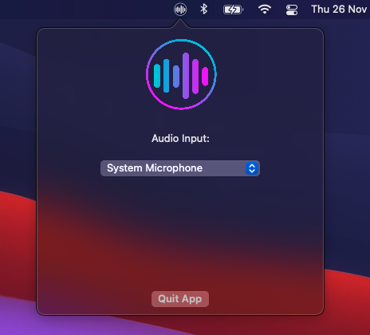
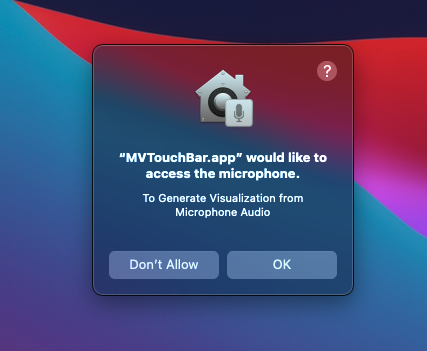
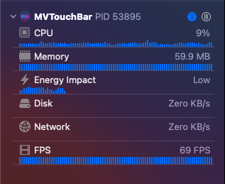

### Features

**Note:** Currently a PoC Application, Major changes need to be done to this application. ( This is also my first Swift Project so it's in no way testament to best programming practices )

- Music Visualizer (Duh!)
- Visualize audio from system microphone
- Low Resource Consumption (9% utilization of a single core, ~60MB Ram )

In Progress
- Visualize system audio directly without microphone
- Visualization Customization (Change Colors, Gradient Support)
### Screenshots
#### Touchbar

#### Menu Bar

### Usage
Download the latest application from the [releases page](https://github.com/TouchbarApps/MVTouchbar/releases). If Gatekeeper throws an error, right-click and then open the app.

Press Allow to the Microphone Permission Prompt (Plans to make it optional after system audio source is supported)

Currently the application starts up as an extra Button in the touchbar, press the button to view the visualizer ( This visualizer is persistent across applications and won't close automatically when you switch applications, thanks to [touch-baer](https://github.com/a2/touch-baer)) 

**Note:** Might be incompatible with tools like Pock or Better Touch Tool, since they use similar methods to override the touchbar switching

### Miscellaneous Screenshots

### License
MVTouchBar is available under the GNU General Public License v3.0. See the [LICENSE file](LICENSE).

Note: This is derived from [Touch-Bar-Visualizer](https://github.com/supersimple33/Touch-Bar-Visualizer/) with additional features and changes.
## Contributors ✨
<!-- ALL-CONTRIBUTORS-BADGE:START - Do not remove or modify this section -->

<!-- ALL-CONTRIBUTORS-BADGE:END -->

Thanks goes to these wonderful people ([emoji key](https://allcontributors.org/docs/en/emoji-key)):

<!-- ALL-CONTRIBUTORS-LIST:START - Do not remove or modify this section -->
<!-- prettier-ignore-start -->
<!-- markdownlint-disable -->
<table>
  <tr>
    <td align="center"><a href="https://www.arpitjain.tech/"> <b>Arpit Jain</b></a> <a href="https://github.com/TouchbarApps/MVTouchbar/commits?author=ArpitKotecha" title="Code">💻</a></td>
    <td align="center"><a href="https://github.com/darshkpatel"> <b>Darsh Patel</b></a> <a href="https://github.com/TouchbarApps/MVTouchbar/commits?author=darshkpatel" title="Documentation">📖</a> <a href="https://github.com/TouchbarApps/MVTouchbar/commits?author=darshkpatel" title="Code">💻</a> <a href="#infra-darshkpatel" title="Infrastructure (Hosting, Build-Tools, etc)">🚇</a></td>
  </tr>
</table>

<!-- markdownlint-restore -->
<!-- prettier-ignore-end -->

<!-- ALL-CONTRIBUTORS-LIST:END -->

This project follows the [all-contributors](https://github.com/all-contributors/all-contributors) specification. Contributions of any kind welcome!
